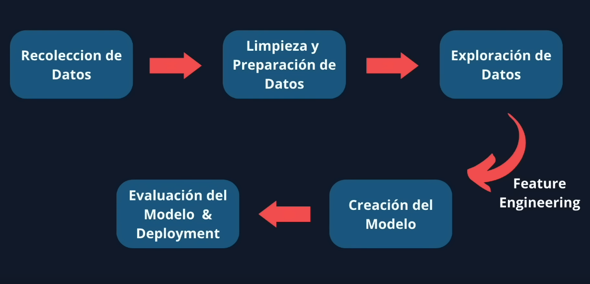
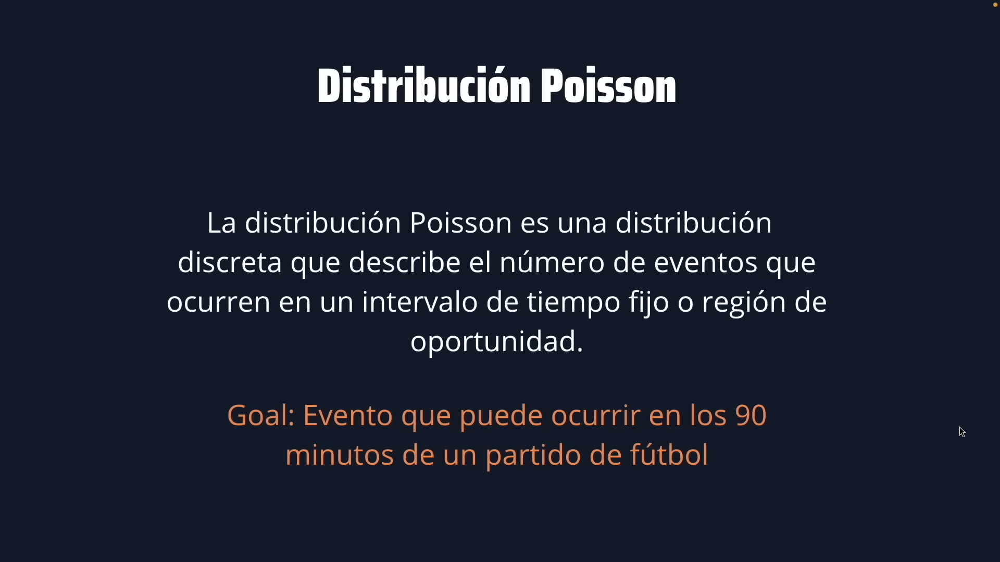
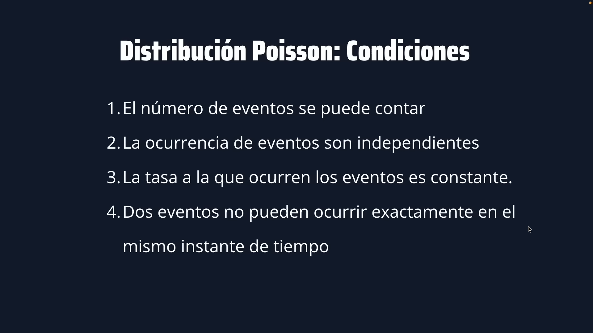
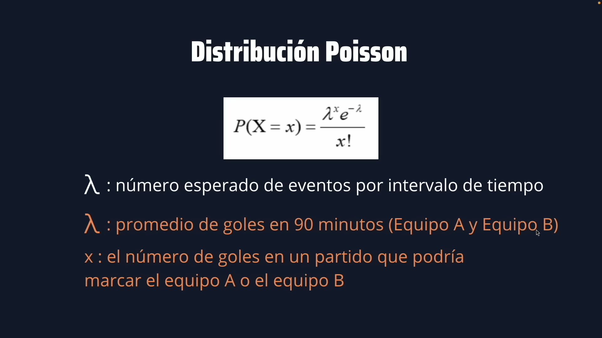

# **Proyecto Data Science From Scratch**

## Predicción del Campeón de la Copa del Mundo 2022

En este proyecto intentaremos predecir al campeón de fútbol de la Copa del Mundo 2022 a partir
de los **datos históricos** que recolectaremos, limpiaremos y organizaremos para realizar,
posteriormente, la predicción del campeón de mundo 2022. Para ello utilizaremos la [Distribución
de Poisson](https://es.wikipedia.org/wiki/Distribuci%C3%B3n_de_Poisson)

# Fases de un Proyecto de Data Science



# Parte 1
## Extracción de los grupos 2022


```python
import pandas as pd
```


```python
# Leo todas las tablas - Tablas vacías de Mundial 2022
all_tables = pd.read_html('https://web.archive.org/web/20221115040351/https://en.wikipedia.org/wiki/2022_FIFA_World_Cup')
```


```python
# Leo las tablas que me interesan (Grupo A hasta Grupo H), las limpio y las guardo en una lista
tables = []
for i in range(12, 62, 7):
    table = all_tables[i]

    # corrijo las columnas
    table.pop('Qualification')
    table.rename(columns={'Teamvte': 'Team'}, inplace=True)
    
    tables.append(table)
```


```python
# Creo un diccionario emparejando el 'grupo' con su respectiva 'tabla'
groups = {}
for i in range(0, len(tables)):
    k = chr(65 + i)
    v = tables[i]

    groups[f'Group {k}'] = v
```


```python
import pickle
```


```python
# Guardo el diccionario de grupos serializado en disco
with open('files/groups.dat', 'wb') as out:
    pickle.dump(groups, out)
```

# Parte 2
## Recolección de datos (todos los mundiales del 1930 al 2018)


```python
import pandas as pd
import requests
from bs4 import BeautifulSoup
```


```python
def get_matches(url, year):
    """Obtiene todos los partidos jugados en un año determinado.
    
    Parameters
    ----------
    year : str or int
      Año del mundial.
    
    Returns
    -------
    pandas.core.frame.DataFrame: Dataframe con el resultado de todos los equipos.
        
    """
        
    response = requests.get(url)
    content = response.text

    # parser lxml
    soup = BeautifulSoup(content, 'lxml')

    # todos los partidos (encuentros)
    matches = soup.find_all('div', class_='footballbox')
    
    home = []
    score = []
    away = []
    for match in matches:
        home.append(match.find('th', class_='fhome').get_text().replace('\xa0', ''))
        score.append(match.find('th', class_='fscore').get_text().replace(' (a.e.t.)', ''))
        away.append(match.find('th', class_='faway').get_text().replace('\xa0', ''))

    df = pd.DataFrame({
        'Home': home,
        'Score': score,
        'Away': away
    })

    df['Year'] = year

    return df
```


```python
# Obtengo los dataframes de todos los mundiales (todos los años)
matches_list = []
for year in range(1930, 2019, 4):
    # elimino los años que no se jugaron mundiales
    if year == 1942 or year == 1946:
        continue

    # URL de la cual voy a extraer los datos de los partidos
    url = f'https://en.wikipedia.org/wiki/{year}_FIFA_World_Cup'
    
    matches_list.append(get_matches(url, year))
```


```python
# unifico todos los mundiales en un único dataframe
df_fifa = pd.concat(matches_list, ignore_index=True)

# los exporto a un archivo csv
df_fifa.to_csv('files/fifa_worldcup_historical_data.csv', index=False)
```

## Extracción del Fixture 2022


```python
# URL de la cual voy a extraer los datos de los partidos
url = 'https://web.archive.org/web/20221115040351/https://en.wikipedia.org/wiki/2022_FIFA_World_Cup'

# año del mundial sin datos (2022)
year = 2022

# extraigo los partidos (encuentros) que se disputarán en 2022
df_fixture = get_matches(url, year)

# lo exporto a un archivo csv
df_fixture.to_csv('files/fifa_worldcup_fixture_2022.csv', index=False)
```

# Parte 3
## Obtención de los datos faltantes con la librería _Selenium_


```python
import pandas as pd
from time import sleep

from selenium import webdriver
from selenium.webdriver.firefox.service import Service
```


```python
def extract_matches(driver, year):
    """Extrae los partidos "faltantes" de la Copa del Mundo en un año determinado.

    Args:
        driver (selenium webdriver): webdriver de selenium instanciado con el servicio
        year (str or int): año del mundial

    Returns:
        pandas.core.frame.dataframe: dataframe con los partidos (equipos y resultados)
    """

    URL = f'https://en.wikipedia.org/wiki/{year}_FIFA_World_Cup'
    
    driver.get(URL)

    matches = driver.find_elements('xpath', '//tr[@style="font-size:90%"]')
    # matches = driver.find_elements('xpath', '//tr[@itemprop="name"]')

    home = []
    score = []
    away = []
    for match in matches:
        home.append(match.find_element('xpath', './td[1]').text.replace('\xa0', ''))
        score.append(match.find_element('xpath', './td[2]').text.replace(' (a.e.t.)', ''))
        away.append(match.find_element('xpath', './td[3]').text.replace('\xa0', ''))

    df = pd.DataFrame({
        'Home': home,
        'Score': score,
        'Away': away
    })

    df['Year'] = year

    return df
```


```python
service = Service(executable_path='driver/geckodriver')
driver = webdriver.Firefox(service=service)

df_list = []
for year in range(1930, 2019, 4):
    # en estos años no se jugaron mundiales
    if year == 1942 or year == 1946:
        continue

    df = extract_matches(driver, year)
    df_list.append(df)
    
    sleep(1)

driver.close()

df_fifa = pd.concat(df_list, ignore_index=True)
df_fifa.to_csv('files/fifa_worldcup_missing_data.csv', index=False)
```

# Parte 4
## Limpieza de los datos


```python
import pandas as pd
```


```python
historical_data = pd.read_csv('files/fifa_worldcup_historical_data.csv')
missing_data = pd.read_csv('files/fifa_worldcup_missing_data.csv')
fixture = pd.read_csv('files/fifa_worldcup_fixture_2022.csv')
```

## Limpiando el fixture


```python
# Esto en mi caso no es necesario porque ya lo limpié al momento de extraer la data
# Sin embargo lo dejo documentado como se hace en el curso porque son métodos interesantes
fixture['Home'] = fixture['Home'].str.strip()
fixture['Away'] = fixture['Away'].str.strip()
```

## Limpiando _missing data_


```python
# Esto está mal en el curso (es incorrecto), y en mi caso no es
# necesario, sin embargo dejo documentado lo que se hizo.

# para saber si hay datos nulos (no son los NaN como se dice)
missing_data[missing_data['Home'].isnull()]
# para eliminarlos
missing_data.dropna(inplace=True)
```

## Agrupando y limpiando toda la data (historical y missing)


```python
# agrupo los dataframes con datos de los partidos
all_data = pd.concat([historical_data, missing_data], ignore_index=True)

# Esto en mi caso no es necesario porque ya lo limpié al momento de extraer la data
# Sin embargo lo dejo documentado como se hace en el curso porque son métodos interesantes
all_data['Home'] = all_data['Home'].str.strip()
all_data['Away'] = all_data['Away'].str.strip()

# elimino valores nulos
all_data.dropna(inplace=True)

# elimino valores duplicados
all_data.drop_duplicates(inplace=True)

# ordeno todos los datos por los valores de la columna 'Year' (de menor a mayor)
all_data.sort_values(by='Year', inplace=True)
```


```python
# Hay un partido que no se jugó
# busco el index (sé cual es porque se indica en el curso)
index_to_drop = all_data[all_data['Home'].str.contains('Sweden') &
                         all_data['Away'].str.contains('Austria')].index

# elimino el partido que no se jugó (por el índice)
all_data.drop(index_to_drop, inplace=True)
```


```python
# ahora debo terminar de limpiar la columna 'Score'
# usamos Regex para encontrar las filas que contienen datos no deseados
# 
# Nota: el circunflejo se usa para indicar NOT y los corchetes indican REGEX
# 
all_data[all_data['Score'].str.contains('[^\d–]')] # el guión lo copio del df (no es el convencional)
```


<div>
<style scoped>
    .dataframe tbody tr th:only-of-type {
        vertical-align: middle;
    }

    .dataframe tbody tr th {
        vertical-align: top;
    }

    .dataframe thead th {
        text-align: right;
    }
</style>
<table border="1" class="dataframe">
  <thead>
    <tr style="text-align: right;">
      <th></th>
      <th>Home</th>
      <th>Score</th>
      <th>Away</th>
      <th>Year</th>
    </tr>
  </thead>
  <tbody>
    <tr>
      <th>531</th>
      <td>France</td>
      <td>1–0 (a.e.t./g.g.)</td>
      <td>Paraguay</td>
      <td>1998</td>
    </tr>
    <tr>
      <th>600</th>
      <td>South Korea</td>
      <td>2–1 (a.e.t./g.g.)</td>
      <td>Italy</td>
      <td>2002</td>
    </tr>
    <tr>
      <th>595</th>
      <td>Sweden</td>
      <td>1–2 (a.e.t./g.g.)</td>
      <td>Senegal</td>
      <td>2002</td>
    </tr>
    <tr>
      <th>604</th>
      <td>Senegal</td>
      <td>0–1 (a.e.t./g.g.)</td>
      <td>Turkey</td>
      <td>2002</td>
    </tr>
  </tbody>
</table>
</div>


```python
# como se ve arriba, hay 4 campos del score que contienen caracteres adicionales
# así que los elimino haciendo un reemplazo por cadena vacía
all_data['Score'] = all_data['Score'].str.replace('[^\d–]', '', regex=True)
```

## Acondicionando los datos para poder procesarlos


```python
# Separo los datos numéricos de la columna 'Score' en dos nuevas columnas y las inserto en el df
all_data[['Home Goals', 'Away Goals']] = all_data['Score'].str.split('[^\d]', expand=True)

# elimino la columna 'Score' porque ya no la necesito
all_data.drop('Score', axis=1, inplace=True)

# cambio los datos de los 'Goals' a tipo integer
all_data = all_data.astype({
    'Home Goals': int,
    'Away Goals': int,
    'Year': int # no es neccesario, pero ya que está lo pongo
})

# renombro las columnas para más claridad
all_data.rename(columns={'Home': 'Home Team', 'Away': 'Away Team'}, inplace=True)
```


```python
# aquí veo como se cambiaron los tipos del df
all_data.dtypes
```


    Home Team     object
    Away Team     object
    Year           int64
    Home Goals     int64
    Away Goals     int64
    dtype: object


```python
# agrego una última columna con los goles totales del partido (sólo por gusto)
# es interesante obervar el hecho de que no podría hacerlo si no hubiera
# cambiado los tipos de datos
all_data['Total Goals'] = all_data['Home Goals'] + all_data['Away Goals']
```


```python
# reorganizo las columnas enviando al final del df a 'Year'
all_data = all_data.reindex(columns=['Home Team', 'Away Team', 'Home Goals', 'Away Goals', 'Total Goals', 'Year'])
```

## Comprobación de los datos


```python
# Compruebo que la cantidad de datos sea correcto (cantidad de partidos por años de mudial)
print('Year    ', 'Matches Played')
print('----    ', '--------------')

for year in range(1930, 2019, 4):
    if year == 1942 or year == 1946:
        continue
        
    matches = all_data[all_data['Year'] == year]
    matches_played = len(matches)
    
    print(year, ' ' * 8, matches_played)
```

    Year     Matches Played
    ----     --------------
    1930          18
    1934          17
    1938          18
    1950          22
    1954          26
    1958          35
    1962          32
    1966          32
    1970          32
    1974          38
    1978          38
    1982          52
    1986          52
    1990          52
    1994          52
    1998          64
    2002          64
    2006          64
    2010          64
    2014          64
    2018          64


## Guardo los dataframes limpios en el disco (formato csv)


```python
all_data.to_csv('files/clean_fifa_worldcup_historical_data.csv', index=False)
fixture.to_csv('files/clean_fifa_worldcup_fixture_2022.csv', index=False)
```

# Parte 5
## Creación del modelo (usando la distribución de Poisson)


```python
import pandas as pd
import pickle
from scipy.stats import poisson
```


```python
# primero recuperamos los datos limpios guardados a disco
historical_data = pd.read_csv('files/clean_fifa_worldcup_historical_data.csv')
fixture = pd.read_csv('files/clean_fifa_worldcup_fixture_2022.csv')

with open('files/groups.dat', 'rb') as file:
    tables = pickle.load(file)
```


```python
tables['Group A']
```


<div>
<style scoped>
    .dataframe tbody tr th:only-of-type {
        vertical-align: middle;
    }

    .dataframe tbody tr th {
        vertical-align: top;
    }

    .dataframe thead th {
        text-align: right;
    }
</style>
<table border="1" class="dataframe">
  <thead>
    <tr style="text-align: right;">
      <th></th>
      <th>Pos</th>
      <th>Team</th>
      <th>Pld</th>
      <th>W</th>
      <th>D</th>
      <th>L</th>
      <th>GF</th>
      <th>GA</th>
      <th>GD</th>
      <th>Pts</th>
    </tr>
  </thead>
  <tbody>
    <tr>
      <th>0</th>
      <td>1</td>
      <td>Qatar (H)</td>
      <td>0</td>
      <td>0</td>
      <td>0</td>
      <td>0</td>
      <td>0</td>
      <td>0</td>
      <td>0</td>
      <td>0</td>
    </tr>
    <tr>
      <th>1</th>
      <td>2</td>
      <td>Ecuador</td>
      <td>0</td>
      <td>0</td>
      <td>0</td>
      <td>0</td>
      <td>0</td>
      <td>0</td>
      <td>0</td>
      <td>0</td>
    </tr>
    <tr>
      <th>2</th>
      <td>3</td>
      <td>Senegal</td>
      <td>0</td>
      <td>0</td>
      <td>0</td>
      <td>0</td>
      <td>0</td>
      <td>0</td>
      <td>0</td>
      <td>0</td>
    </tr>
    <tr>
      <th>3</th>
      <td>4</td>
      <td>Netherlands</td>
      <td>0</td>
      <td>0</td>
      <td>0</td>
      <td>0</td>
      <td>0</td>
      <td>0</td>
      <td>0</td>
      <td>0</td>
    </tr>
  </tbody>
</table>
</div>


## Calcular el Team Strength (poderío del equipo)


```python
# ahora crearemos un df unificado conteniendo 3 columnas
# 1. 'Equipo'  2. 'Goles Anotados'  '3. Goles Recbidos'
# 
# primero separamos y renombramos las columnas en 2 dataframes
home_data = historical_data[['Home Team', 'Home Goals', 'Away Goals']]
away_data = historical_data[['Away Team', 'Home Goals', 'Away Goals']]

home_data = home_data.rename(columns={'Home Team': 'Team', 'Home Goals': 'Scored Goals', 'Away Goals': 'Conceded Goals'})
away_data = away_data.rename(columns={'Away Team': 'Team', 'Away Goals': 'Scored Goals', 'Home Goals': 'Conceded Goals'})
```


```python
# concateno los dfs y agrupo por 'Team'
data = pd.concat([home_data, away_data], ignore_index=True)

# calculo el promedio de goles de c/u
team_strength = data.groupby('Team').mean()
```


```python
team_strength
```


<div>
<style scoped>
    .dataframe tbody tr th:only-of-type {
        vertical-align: middle;
    }

    .dataframe tbody tr th {
        vertical-align: top;
    }

    .dataframe thead th {
        text-align: right;
    }
</style>
<table border="1" class="dataframe">
  <thead>
    <tr style="text-align: right;">
      <th></th>
      <th>Scored Goals</th>
      <th>Conceded Goals</th>
    </tr>
    <tr>
      <th>Team</th>
      <th></th>
      <th></th>
    </tr>
  </thead>
  <tbody>
    <tr>
      <th>Algeria</th>
      <td>1.000000</td>
      <td>1.461538</td>
    </tr>
    <tr>
      <th>Angola</th>
      <td>0.333333</td>
      <td>0.666667</td>
    </tr>
    <tr>
      <th>Argentina</th>
      <td>1.691358</td>
      <td>1.148148</td>
    </tr>
    <tr>
      <th>Australia</th>
      <td>0.812500</td>
      <td>1.937500</td>
    </tr>
    <tr>
      <th>Austria</th>
      <td>1.482759</td>
      <td>1.620690</td>
    </tr>
    <tr>
      <th>...</th>
      <td>...</td>
      <td>...</td>
    </tr>
    <tr>
      <th>Uruguay</th>
      <td>1.553571</td>
      <td>1.321429</td>
    </tr>
    <tr>
      <th>Wales</th>
      <td>0.800000</td>
      <td>0.800000</td>
    </tr>
    <tr>
      <th>West Germany</th>
      <td>2.112903</td>
      <td>1.241935</td>
    </tr>
    <tr>
      <th>Yugoslavia</th>
      <td>1.666667</td>
      <td>1.272727</td>
    </tr>
    <tr>
      <th>Zaire</th>
      <td>0.000000</td>
      <td>4.666667</td>
    </tr>
  </tbody>
</table>
<p>85 rows × 2 columns</p>
</div>


# Usando Poisson

## Cosideraciones sobre la distribución de poisson





## Function predict_points


```python
def predict_points(home, away):
    if home in team_strength.index and away in team_strength.index:
        # scored_goals * conceded_goals
        home_lamb = team_strength.at[home, 'Scored Goals'] * team_strength.at[away, 'Conceded Goals']
        away_lamb = team_strength.at[away, 'Scored Goals'] * team_strength.at[home, 'Conceded Goals']
        
        prob_home, prob_away, prob_draw = 0, 0, 0
        for home_goals in range(0, 11):
            for away_goals in range(0,11):
                probability = poisson.pmf(home_goals, home_lamb) * poisson.pmf(away_goals, away_lamb)

                if home_goals > away_goals:
                    prob_home += probability
                elif home_goals < away_goals:
                    prob_away += probability
                else:
                    prob_draw += probability

        home_points = 3 * prob_home + prob_draw
        away_points = 3 * prob_away + prob_draw

        return (home_points, away_points)

    else: 
        return (0, 0)
```


```python
predict_points('Argentina', 'Mexico')
```


    (2.3129151525530505, 0.5378377125059863)


# Prediciendo el Mundial 2022
## Fase de grupo


```python
# divido el fixture en grupo, octavos, cuartos, etc
fixture_group_48 = fixture[:48].copy()
fixture_knockout = fixture[48:56].copy()
fixture_quarter = fixture[56:60].copy()
fixture_semi = fixture[60:62].copy()
fixture_final = fixture[62:].copy()
```


```python
# un ejemplo de la fragmentación del fixture (en este caso los cuartos de final)
fixture_quarter
```


<div>
<style scoped>
    .dataframe tbody tr th:only-of-type {
        vertical-align: middle;
    }

    .dataframe tbody tr th {
        vertical-align: top;
    }

    .dataframe thead th {
        text-align: right;
    }
</style>
<table border="1" class="dataframe">
  <thead>
    <tr style="text-align: right;">
      <th></th>
      <th>Home</th>
      <th>Score</th>
      <th>Away</th>
      <th>Year</th>
    </tr>
  </thead>
  <tbody>
    <tr>
      <th>56</th>
      <td>Winners Match 53</td>
      <td>Match 58</td>
      <td>Winners Match 54</td>
      <td>2022</td>
    </tr>
    <tr>
      <th>57</th>
      <td>Winners Match 49</td>
      <td>Match 57</td>
      <td>Winners Match 50</td>
      <td>2022</td>
    </tr>
    <tr>
      <th>58</th>
      <td>Winners Match 55</td>
      <td>Match 60</td>
      <td>Winners Match 56</td>
      <td>2022</td>
    </tr>
    <tr>
      <th>59</th>
      <td>Winners Match 51</td>
      <td>Match 59</td>
      <td>Winners Match 52</td>
      <td>2022</td>
    </tr>
  </tbody>
</table>
</div>


```python
# interesante observar que esto me devuelve un ndarray (numpy)
# los nombres de la columna 'Team' del 'grupo A'
tables['Group A']['Team'].values
```


    array(['Qatar (H)', 'Ecuador', 'Senegal', 'Netherlands'], dtype=object)


#### Esto es otro error en el curso que no fue tomado en cuenta (si bien no afectaría el resultado final, ya que Qatar no es tomado en cuenta en las predicciones por no tener data histórica)


```python
# de lo anterior observamos que hay discrepancias de nombres entre
# las tablas de Grupos y el Fixture. Específicamente con el nombre
# 'Qatar' vs 'Qatar (H)' (fixture vs grupos)
#
# por tanto corregimos el nombre en el fixture (forma fácil)
fixture_group_48.replace({'Qatar': 'Qatar (H)'}, inplace=True)

# por tanto corregimos el nombre en el fixture (forma complicada)
# for index, row in fixture_group_48.iterrows():
#     if row['Home'] == 'Qatar':
#         fixture_group_48.loc[index, 'Home'] = 'Qatar (H)'

#     if row['Away'] == 'Qatar':
#         fixture_group_48.loc[index, 'Away'] = 'Qatar (H)'
```


```python
# predigo todos los partidos de la fase de grupo y actualizo sus respectivas tablas
for group in tables:
    group_table = tables[group]['Team'].values
    group_matches = fixture_group_48[fixture_group_48['Home'].isin(group_table)]

    for index, row in group_matches.iterrows():
        home, away = row['Home'], row['Away']

        home_points, away_points = predict_points(home, away)

        tables[group]['Pts'] = tables[group]['Pts'].astype(float)
        tables[group].loc[tables[group]['Team'] == home, 'Pts'] += home_points
        tables[group].loc[tables[group]['Team'] == away, 'Pts'] += away_points

    tables[group] = tables[group].sort_values('Pts', ascending=False).reset_index()
    tables[group] = tables[group][['Team', 'Pts']]
    
    tables[group] = tables[group].round(0)
    tables[group]['Pts'] = tables[group]['Pts'].astype(int)
```


```python
# así quedarían las tablas de puntos (diccionario)
tables['Group A']
```


<div>
<style scoped>
    .dataframe tbody tr th:only-of-type {
        vertical-align: middle;
    }

    .dataframe tbody tr th {
        vertical-align: top;
    }

    .dataframe thead th {
        text-align: right;
    }
</style>
<table border="1" class="dataframe">
  <thead>
    <tr style="text-align: right;">
      <th></th>
      <th>Team</th>
      <th>Pts</th>
    </tr>
  </thead>
  <tbody>
    <tr>
      <th>0</th>
      <td>Netherlands</td>
      <td>4</td>
    </tr>
    <tr>
      <th>1</th>
      <td>Senegal</td>
      <td>2</td>
    </tr>
    <tr>
      <th>2</th>
      <td>Ecuador</td>
      <td>2</td>
    </tr>
    <tr>
      <th>3</th>
      <td>Qatar (H)</td>
      <td>0</td>
    </tr>
  </tbody>
</table>
</div>


## Octavos


```python
fixture_knockout
```


<div>
<style scoped>
    .dataframe tbody tr th:only-of-type {
        vertical-align: middle;
    }

    .dataframe tbody tr th {
        vertical-align: top;
    }

    .dataframe thead th {
        text-align: right;
    }
</style>
<table border="1" class="dataframe">
  <thead>
    <tr style="text-align: right;">
      <th></th>
      <th>Home</th>
      <th>Score</th>
      <th>Away</th>
      <th>Year</th>
    </tr>
  </thead>
  <tbody>
    <tr>
      <th>48</th>
      <td>Winners Group A</td>
      <td>Match 49</td>
      <td>Runners-up Group B</td>
      <td>2022</td>
    </tr>
    <tr>
      <th>49</th>
      <td>Winners Group C</td>
      <td>Match 50</td>
      <td>Runners-up Group D</td>
      <td>2022</td>
    </tr>
    <tr>
      <th>50</th>
      <td>Winners Group D</td>
      <td>Match 52</td>
      <td>Runners-up Group C</td>
      <td>2022</td>
    </tr>
    <tr>
      <th>51</th>
      <td>Winners Group B</td>
      <td>Match 51</td>
      <td>Runners-up Group A</td>
      <td>2022</td>
    </tr>
    <tr>
      <th>52</th>
      <td>Winners Group E</td>
      <td>Match 53</td>
      <td>Runners-up Group F</td>
      <td>2022</td>
    </tr>
    <tr>
      <th>53</th>
      <td>Winners Group G</td>
      <td>Match 54</td>
      <td>Runners-up Group H</td>
      <td>2022</td>
    </tr>
    <tr>
      <th>54</th>
      <td>Winners Group F</td>
      <td>Match 55</td>
      <td>Runners-up Group E</td>
      <td>2022</td>
    </tr>
    <tr>
      <th>55</th>
      <td>Winners Group H</td>
      <td>Match 56</td>
      <td>Runners-up Group G</td>
      <td>2022</td>
    </tr>
  </tbody>
</table>
</div>


```python
tables['Group A']
```


<div>
<style scoped>
    .dataframe tbody tr th:only-of-type {
        vertical-align: middle;
    }

    .dataframe tbody tr th {
        vertical-align: top;
    }

    .dataframe thead th {
        text-align: right;
    }
</style>
<table border="1" class="dataframe">
  <thead>
    <tr style="text-align: right;">
      <th></th>
      <th>Team</th>
      <th>Pts</th>
    </tr>
  </thead>
  <tbody>
    <tr>
      <th>0</th>
      <td>Netherlands</td>
      <td>4</td>
    </tr>
    <tr>
      <th>1</th>
      <td>Senegal</td>
      <td>2</td>
    </tr>
    <tr>
      <th>2</th>
      <td>Ecuador</td>
      <td>2</td>
    </tr>
    <tr>
      <th>3</th>
      <td>Qatar (H)</td>
      <td>0</td>
    </tr>
  </tbody>
</table>
</div>


```python
# actualizo el fixture de octavos de final
for group in tables:
    winner = tables[group].loc[0, 'Team']
    runners_up = tables[group].loc[1, 'Team']

    fixture_knockout.replace({
        f'Winners {group}': winner,
        f'Runners-up {group}': runners_up
    }, inplace=True)

fixture_knockout
```


<div>
<style scoped>
    .dataframe tbody tr th:only-of-type {
        vertical-align: middle;
    }

    .dataframe tbody tr th {
        vertical-align: top;
    }

    .dataframe thead th {
        text-align: right;
    }
</style>
<table border="1" class="dataframe">
  <thead>
    <tr style="text-align: right;">
      <th></th>
      <th>Home</th>
      <th>Score</th>
      <th>Away</th>
      <th>Year</th>
    </tr>
  </thead>
  <tbody>
    <tr>
      <th>48</th>
      <td>Netherlands</td>
      <td>Match 49</td>
      <td>Wales</td>
      <td>2022</td>
    </tr>
    <tr>
      <th>49</th>
      <td>Argentina</td>
      <td>Match 50</td>
      <td>Denmark</td>
      <td>2022</td>
    </tr>
    <tr>
      <th>50</th>
      <td>France</td>
      <td>Match 52</td>
      <td>Poland</td>
      <td>2022</td>
    </tr>
    <tr>
      <th>51</th>
      <td>England</td>
      <td>Match 51</td>
      <td>Senegal</td>
      <td>2022</td>
    </tr>
    <tr>
      <th>52</th>
      <td>Germany</td>
      <td>Match 53</td>
      <td>Belgium</td>
      <td>2022</td>
    </tr>
    <tr>
      <th>53</th>
      <td>Brazil</td>
      <td>Match 54</td>
      <td>Uruguay</td>
      <td>2022</td>
    </tr>
    <tr>
      <th>54</th>
      <td>Croatia</td>
      <td>Match 55</td>
      <td>Spain</td>
      <td>2022</td>
    </tr>
    <tr>
      <th>55</th>
      <td>Portugal</td>
      <td>Match 56</td>
      <td>Switzerland</td>
      <td>2022</td>
    </tr>
  </tbody>
</table>
</div>


```python
# función para obtener los ganadores de los octavos de final
def get_winner(fix):
    for index, row in fix.iterrows():
        home, away = row['Home'], row['Away']

        home_pts, away_pts = predict_points(home, away)

        if home_pts > away_pts:
            fix.loc[index, 'Winner'] = home
        else:
            fix.loc[index, 'Winner'] = away
```


```python
get_winner(fixture_knockout)
fixture_knockout
```


<div>
<style scoped>
    .dataframe tbody tr th:only-of-type {
        vertical-align: middle;
    }

    .dataframe tbody tr th {
        vertical-align: top;
    }

    .dataframe thead th {
        text-align: right;
    }
</style>
<table border="1" class="dataframe">
  <thead>
    <tr style="text-align: right;">
      <th></th>
      <th>Home</th>
      <th>Score</th>
      <th>Away</th>
      <th>Year</th>
      <th>Winner</th>
    </tr>
  </thead>
  <tbody>
    <tr>
      <th>48</th>
      <td>Netherlands</td>
      <td>Match 49</td>
      <td>Wales</td>
      <td>2022</td>
      <td>Netherlands</td>
    </tr>
    <tr>
      <th>49</th>
      <td>Argentina</td>
      <td>Match 50</td>
      <td>Denmark</td>
      <td>2022</td>
      <td>Argentina</td>
    </tr>
    <tr>
      <th>50</th>
      <td>France</td>
      <td>Match 52</td>
      <td>Poland</td>
      <td>2022</td>
      <td>France</td>
    </tr>
    <tr>
      <th>51</th>
      <td>England</td>
      <td>Match 51</td>
      <td>Senegal</td>
      <td>2022</td>
      <td>England</td>
    </tr>
    <tr>
      <th>52</th>
      <td>Germany</td>
      <td>Match 53</td>
      <td>Belgium</td>
      <td>2022</td>
      <td>Germany</td>
    </tr>
    <tr>
      <th>53</th>
      <td>Brazil</td>
      <td>Match 54</td>
      <td>Uruguay</td>
      <td>2022</td>
      <td>Brazil</td>
    </tr>
    <tr>
      <th>54</th>
      <td>Croatia</td>
      <td>Match 55</td>
      <td>Spain</td>
      <td>2022</td>
      <td>Spain</td>
    </tr>
    <tr>
      <th>55</th>
      <td>Portugal</td>
      <td>Match 56</td>
      <td>Switzerland</td>
      <td>2022</td>
      <td>Portugal</td>
    </tr>
  </tbody>
</table>
</div>


## Cuartos de final


```python
fixture_quarter
```


<div>
<style scoped>
    .dataframe tbody tr th:only-of-type {
        vertical-align: middle;
    }

    .dataframe tbody tr th {
        vertical-align: top;
    }

    .dataframe thead th {
        text-align: right;
    }
</style>
<table border="1" class="dataframe">
  <thead>
    <tr style="text-align: right;">
      <th></th>
      <th>Home</th>
      <th>Score</th>
      <th>Away</th>
      <th>Year</th>
    </tr>
  </thead>
  <tbody>
    <tr>
      <th>56</th>
      <td>Winners Match 53</td>
      <td>Match 58</td>
      <td>Winners Match 54</td>
      <td>2022</td>
    </tr>
    <tr>
      <th>57</th>
      <td>Winners Match 49</td>
      <td>Match 57</td>
      <td>Winners Match 50</td>
      <td>2022</td>
    </tr>
    <tr>
      <th>58</th>
      <td>Winners Match 55</td>
      <td>Match 60</td>
      <td>Winners Match 56</td>
      <td>2022</td>
    </tr>
    <tr>
      <th>59</th>
      <td>Winners Match 51</td>
      <td>Match 59</td>
      <td>Winners Match 52</td>
      <td>2022</td>
    </tr>
  </tbody>
</table>
</div>


```python
def resolve_fixture(complete_fixture, unresolved_fixture):
    for idx, row in complete_fixture.iterrows():
        match, winner = row['Score'], row['Winner']
        
        unresolved_fixture.replace({f'Winners {match}': winner}, inplace=True)
```


```python
resolve_fixture(fixture_knockout, fixture_quarter)
get_winner(fixture_quarter)

fixture_quarter
```


<div>
<style scoped>
    .dataframe tbody tr th:only-of-type {
        vertical-align: middle;
    }

    .dataframe tbody tr th {
        vertical-align: top;
    }

    .dataframe thead th {
        text-align: right;
    }
</style>
<table border="1" class="dataframe">
  <thead>
    <tr style="text-align: right;">
      <th></th>
      <th>Home</th>
      <th>Score</th>
      <th>Away</th>
      <th>Year</th>
      <th>Winner</th>
    </tr>
  </thead>
  <tbody>
    <tr>
      <th>56</th>
      <td>Germany</td>
      <td>Match 58</td>
      <td>Brazil</td>
      <td>2022</td>
      <td>Brazil</td>
    </tr>
    <tr>
      <th>57</th>
      <td>Netherlands</td>
      <td>Match 57</td>
      <td>Argentina</td>
      <td>2022</td>
      <td>Netherlands</td>
    </tr>
    <tr>
      <th>58</th>
      <td>Spain</td>
      <td>Match 60</td>
      <td>Portugal</td>
      <td>2022</td>
      <td>Portugal</td>
    </tr>
    <tr>
      <th>59</th>
      <td>England</td>
      <td>Match 59</td>
      <td>France</td>
      <td>2022</td>
      <td>France</td>
    </tr>
  </tbody>
</table>
</div>


```python
resolve_fixture(fixture_quarter, fixture_semi)
get_winner(fixture_semi)

fixture_semi
```


<div>
<style scoped>
    .dataframe tbody tr th:only-of-type {
        vertical-align: middle;
    }

    .dataframe tbody tr th {
        vertical-align: top;
    }

    .dataframe thead th {
        text-align: right;
    }
</style>
<table border="1" class="dataframe">
  <thead>
    <tr style="text-align: right;">
      <th></th>
      <th>Home</th>
      <th>Score</th>
      <th>Away</th>
      <th>Year</th>
      <th>Winner</th>
    </tr>
  </thead>
  <tbody>
    <tr>
      <th>60</th>
      <td>Netherlands</td>
      <td>Match 61</td>
      <td>Brazil</td>
      <td>2022</td>
      <td>Brazil</td>
    </tr>
    <tr>
      <th>61</th>
      <td>France</td>
      <td>Match 62</td>
      <td>Portugal</td>
      <td>2022</td>
      <td>France</td>
    </tr>
  </tbody>
</table>
</div>


```python
# obtengo el ganador (no resuelvo el segundo y tercer lugar)
resolve_fixture(fixture_semi, fixture_final)

# para no tener que armar una función solo para modificar una línea del df
# para los tercero y cuarto puesto, lo modifico manualmente
fixture_final.replace({
    'Losers Match 61': 'Netherlands',
    'Losers Match 62': 'Portugal'
}, inplace=True)

get_winner(fixture_final)

fixture_final
```


<div>
<style scoped>
    .dataframe tbody tr th:only-of-type {
        vertical-align: middle;
    }

    .dataframe tbody tr th {
        vertical-align: top;
    }

    .dataframe thead th {
        text-align: right;
    }
</style>
<table border="1" class="dataframe">
  <thead>
    <tr style="text-align: right;">
      <th></th>
      <th>Home</th>
      <th>Score</th>
      <th>Away</th>
      <th>Year</th>
      <th>Winner</th>
    </tr>
  </thead>
  <tbody>
    <tr>
      <th>62</th>
      <td>Netherlands</td>
      <td>Match 63</td>
      <td>Portugal</td>
      <td>2022</td>
      <td>Netherlands</td>
    </tr>
    <tr>
      <th>63</th>
      <td>Brazil</td>
      <td>Match 64</td>
      <td>France</td>
      <td>2022</td>
      <td>Brazil</td>
    </tr>
  </tbody>
</table>
</div>


# Final positions Worldcup 2022 (predicción)

1. **Brazil**
2. **France**
3. **Netherlands**
4. **Portugal**
