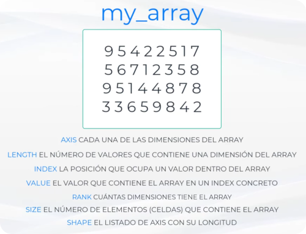

# Clase de Numpy - Ademass (1 hora)




```python
import numpy as np
```

### Dado el siguiente array bidimensional de 4x3.


```python
my_array = np.linspace(0, 11, 12, dtype=int).reshape(4,3)
```


```python
my_array
```


    array([[ 0,  1,  2],
           [ 3,  4,  5],
           [ 6,  7,  8],
           [ 9, 10, 11]])


### Definimos las siguientes características:

| Característica | Descripción | Valor para my_array |
|----------------|-------------|---------------------|
|  **Axis**      | cada una de las dimensiones del array | tiene 2 (x,y) |
|  **Length**    | el número de valores que contiene una dimensión del array | x=3, y=4 |
|  **Index**     | posición de un valor dentro del array | 7 corresponde a (2,1) |
|  **Value**     | el valor que contiene el array en un index concreto | (1,2) tiene el valor 5 |
|  **Rank**      | cuántas dimensiones tiene el array | 2 |
|  **Size**      | el número de elementos (celdas) que contiene el array | 12 |
|  **shape**     | el listado de AXIS con su longitud | 4 x 3 |

### Algunos ejemplos:


```python
# Array vacío de dimensión 4x4 (relleno con basura)
np.empty((4,4))
```


    array([[4.64319115e-310, 0.00000000e+000, 2.41907520e-312,
            2.14321575e-312],
           [2.46151512e-312, 2.31297541e-312, 2.35541533e-312,
            2.05833592e-312],
           [2.22809558e-312, 2.56761491e-312, 2.48273508e-312,
            2.05833592e-312],
           [2.05833592e-312, 2.29175545e-312, 2.07955588e-312,
            2.14321575e-312]])


```python
# Array vacío de dimensión 4x4 (relleno con zeros)
np.zeros((4,4), int)
```


    array([[0, 0, 0, 0],
           [0, 0, 0, 0],
           [0, 0, 0, 0],
           [0, 0, 0, 0]])


```python
# Array dimensión 2x3 relleno de "unos"
np.ones((2,3), int)
```


    array([[1, 1, 1],
           [1, 1, 1]])


```python
# Array de 5x4 relleno de ochos
np.full((5,4), 8)
```


    array([[8, 8, 8, 8],
           [8, 8, 8, 8],
           [8, 8, 8, 8],
           [8, 8, 8, 8],
           [8, 8, 8, 8]])


```python
# Array de 5x3 relleno con números aleatorios
np.random.rand(5,3)
```


    array([[0.50399253, 0.07466291, 0.1653578 ],
           [0.48787129, 0.35690243, 0.85998145],
           [0.64758805, 0.87975286, 0.06688693],
           [0.49216076, 0.43082918, 0.46064847],
           [0.20427743, 0.36472118, 0.02503452]])


```python
# Array de 4x3 relleno de números enteros aleatorios entre 0 y 9
arr = np.random.randint(0,10, (4,3))
arr
```


    array([[3, 2, 9],
           [5, 6, 8],
           [7, 7, 9],
           [9, 7, 0]])


```python
# El array anterior "reshaped" a 3x4
arr.reshape(3,4) # no modifica el original
```


    array([[3, 2, 9, 5],
           [6, 8, 7, 7],
           [9, 9, 7, 0]])


```python
# Otra forma de hacer "reshape"
np.reshape(arr, (2,6))
```


    array([[3, 2, 9, 5, 6, 8],
           [7, 7, 9, 9, 7, 0]])


```python
# podemos observar que el array original no cambia su "shape"
print(arr)
```

    [[3 2 9]
     [5 6 8]
     [7 7 9]
     [9 7 0]]


```python
# convertir una lista en ndarray
lista = [22, 34, 1, -43, 0, 66]
np.array(lista).reshape(2,3)
```


    array([[ 22,  34,   1],
           [-43,   0,  66]])


```python
# Dieciséis números distribuidos entre 0 y 15 (le llama rangos)
np.linspace(0, 15, 16, dtype=int).reshape(4,4)
```


    array([[ 0,  1,  2,  3],
           [ 4,  5,  6,  7],
           [ 8,  9, 10, 11],
           [12, 13, 14, 15]])


```python
# para saber el "shape" de un ndarray
arr.shape
```


    (4, 3)


```python
# para conocer el tamaño (cantidad de elemntos)
arr.size
```


    12


### Operaciones con ndarrays


```python
# suma de arrays
arr1 = np.array([2,2,2])
arr2 = np.array([3,3,3])

arr1 + arr2
```


    array([5, 5, 5])


```python
# resta de arrays
arr1 - arr2
```


    array([-1, -1, -1])


```python
# multiplicación de arrays
arr1 * arr2
```


    array([6, 6, 6])


```python
# división de arrays
arr1 / arr2
```


    array([0.66666667, 0.66666667, 0.66666667])


### Funciones especiales con arrays

Dado el siguiente array:


```python
arr
```


    array([[3, 2, 9],
           [5, 6, 8],
           [7, 7, 9],
           [9, 7, 0]])


Calculamos:


```python
# media aritmética
arr.mean()
```


    6.0


```python
# valor máximo
arr.max()
```


    9


```python
# valor mínimo
arr.min()
```


    0


```python
# suma todos sus elementos
arr.sum()
```


    72


### Accediendo a los elementos del ndarray


```python
arr[2][2]
```


    9


```python
arr[0,2]
```


    9


```python
# submatriz 1,2 - 2,3
arr[0:2,1::]
```


    array([[2, 9],
           [6, 8]])


### Desenvolviendo un array multidimensional


```python
arr.ravel()
```


    array([3, 2, 9, 5, 6, 8, 7, 7, 9, 9, 7, 0])


